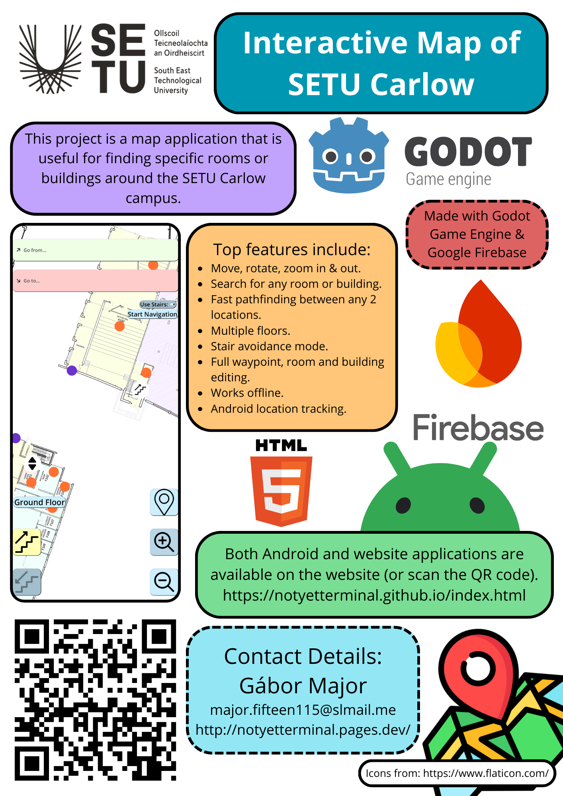

# SETU Interactive Map Application
The Interactive Map of SETU Carlow is a cross platform map application that helps people navigate around the SETU Carlow campus.

This repository contains the source code and the documentation for the project. The application was written using GDScript using the Godot game engine. The documentation contains the the Functional Specification, the Research Poster, the Design Document, and the Final Report. Access them at the following links along with the source code:
 - [Website with information on the project.](https://notyetterminal.github.io/)
 - [Interactive web application.](https://notyetterminal.github.io/map_application/Interactive%20Map%20of%20SETU%20Carlow.html)
 - [Repository for website.](https://github.com/NotYetTerminal/notyetterminal.github.io)

_Project Poster_  

